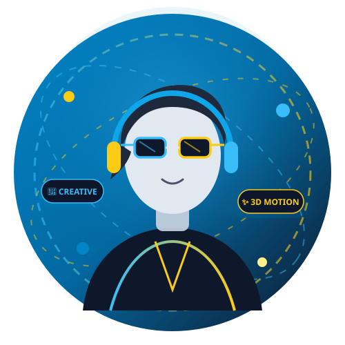

# 🎨 Creative Media Student Portfolio (พอร์ตโฟลิโอสื่อนฤมิต)

เว็บไซต์ Portfolio ส่วนตัวสำหรับนักศึกษาสาขาสื่อนฤมิต (Creative Media) ในรูปแบบ Multi-Page Web Application ที่มีความสวยงาม ทันสมัย สไตล์ **Modern, Creative, Premium & Glassmorphism** พร้อมระบบสลับ **Dark / Light Mode**



---

## 🌟 จุดเด่นของโปรเจกต์ (Key Features)

- **🎨 ดีไซน์ร่วมสมัย (Modern & Creative)**: โทนสีหลัก **ฟ้า (Electric Blue) & เหลือง (Cyber Gold)** พร้อมเอฟเฟกต์ Glassmorphism, Mesh Gradient Animations และ Micro-Interactions ที่นุ่มนวล
- **📱 รองรับทุกหน้าจอ (Fully Responsive)**: ออกแบบด้วย Bootstrap 5.3 และ Custom CSS Grid/Flexbox รองรับทั้งมือถือ แท็บเล็ต และคอมพิวเตอร์
- **🌗 Dark / Light Mode**: สลับโหมดมืด-สว่างได้ง่ายดาย พร้อมจดจำค่าอัตโนมัติผ่าน `localStorage`
- **📂 โครงสร้างแบบแยกหน้า (Multi-Page Architecture)**:
  - `index.html` - หน้าแรก (Home Landing Page & Highlights)
  - `about.html` - เกี่ยวกับผม (ประวัติการศึกษา, ความสนใจ, เป้าหมาย และ Creative Process)
  - `skills.html` - ทักษะ 10 ด้าน พร้อมระดับความเชี่ยวชาญ และเครื่องมือ Toolkit
  - `portfolio.html` - แกลเลอรี 6 ผลงาน พร้อมปุ่มกรองหมวดหมู่ และ Interactive Detail Modal
  - `contact.html` - ข้อมูลติดต่อ ลิงก์ 5 โซเชียลมีเดีย (Email, Facebook, Instagram, GitHub, Behance) และฟอร์ม Interactive
- **⚡ แอนิเมชันลื่นไหล**: Preloader Animation, Sticky Navigation Bar, Active Scrollspy, Scroll Reveal และปุ่ม Floating Scroll-to-Top

---

## 🛠️ เทคโนโลยีที่ใช้ (Tech Stack)

- **HTML5 & CSS3** (Semantic Tags, CSS Custom Properties, Glassmorphism, Keyframes)
- **JavaScript (ES6+)** (DOM Manipulation, IntersectionObserver, LocalStorage, Form Validation)
- **Bootstrap 5.3.3** (Responsive Grid, Modal, Navbar Collapse)
- **Google Fonts** (`Kanit` & `Plus Jakarta Sans`)
- **Font Awesome 6.5.2** (Vector Icons)

---

## 📁 โครงสร้างโฟลเดอร์ (Directory Structure)

```text
webportfolio/
├── index.html                   # หน้าแรก
├── about.html                   # หน้าเกี่ยวกับผม
├── skills.html                  # หน้าทักษะ 10 ด้าน
├── portfolio.html               # หน้าผลงาน 6 ชิ้น พร้อม Modal
├── contact.html                 # หน้าติดต่อและฟอร์มส่งข้อความ
├── README.md                    # เอกสารประกอบโปรเจกต์
├── .gitignore                   # รายการไฟล์ที่ไม่ต้องการนำขึ้น Git
└── assets/
    ├── css/                     # สไตล์ชีตแยกตามโมดูล
    │   ├── style.css
    │   ├── navbar.css
    │   ├── hero.css
    │   ├── about.css
    │   ├── skills.css
    │   ├── portfolio.css
    │   └── contact.css
    ├── js/                      # สคริปต์แยกตามการทำงาน
    │   ├── main.js
    │   ├── navbar.js
    │   ├── portfolio.js
    │   └── contact.js
    └── images/                  # เวกเตอร์ SVG สำหรับโปรไฟล์และผลงาน
        ├── profile-placeholder.svg
        ├── project-1.svg
        ├── project-2.svg
        ├── project-3.svg
        ├── project-4.svg
        ├── project-5.svg
        └── project-6.svg
```

---

## 🚀 วิธีการเปิดใช้งานบนเครื่อง (Local Run)

### ผ่าน XAMPP:
1. นำโฟลเดอร์นี้ไปไว้ที่ `c:/xampp/htdocs/webportfolio`
2. เปิด XAMPP Control Panel แล้วกด Start โมดูล **Apache**
3. เปิดเบราว์เซอร์ไปที่ `http://localhost/webportfolio/`

### เปิดไฟล์โดยตรง:
ดับเบิลคลิกเปิดไฟล์ `index.html` บนเบราว์เซอร์ Google Chrome, Edge หรือ Safari ได้ทันที

---

## 🌐 การเผยแพร่ผ่าน GitHub Pages (Live Demo)

1. อัปโหลดโค้ดขึ้น GitHub Repository
2. ไปที่เมนู **Settings** > **Pages**
3. ในส่วน **Build and deployment > Branch**:
   - เลือก Branch เป็น `main` (หรือ `master`)
   - เลือกโฟลเดอร์เป็น `/ (root)`
4. กด **Save** รอประมาณ 1-2 นาที คุณจะได้ URL เว็บไซต์จริง เช่น:  
   `https://<YOUR-USERNAME>.github.io/<YOUR-REPO-NAME>/`

---

## 📄 ลิขสิทธิ์ (License)

&copy; 2026 Designed & Developed by **Panuwat Narumitsin** (Creative Media Student)
